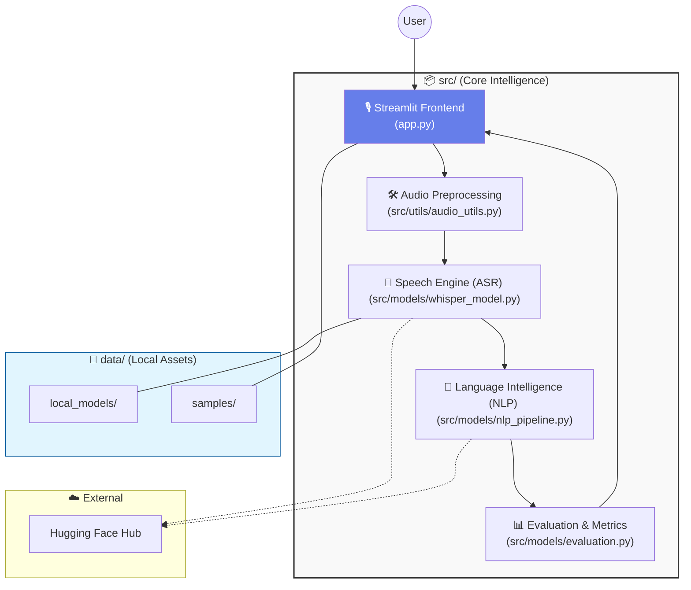

# AI Speech Intelligence System: Smart Meeting & Lecture Assistant

## 🎙️ Project Overview
This project is a GPU-accelerated multimodal AI application designed to transform speech into actionable intelligence. It leverages **OpenAI's Whisper-medium** model for high-fidelity speech-to-text and a suite of NLP models for downstream analysis including summarization, sentiment analysis, action item extraction, and translation.

### Key Features
- **Speech-to-Text**: Local, GPU-accelerated transcription using `openai/whisper-small`.
- **Multilingual Support**: Automatic language detection and translation to English.
- **Text-to-Speech (TTS)**: Convert transcribed text back to audio using `microsoft/speecht5_tts`.
- **Smart Analytics**: 
    - Abstractive Summarization (BART)
    - Sentiment Analysis (DistilBERT)
    - Action Item Extraction (Rule-based NLP)
    - Key Topic Extraction
- **Evaluation Dashboard**: Benchmark Word Error Rate (WER) and latency across different model settings (Greedy vs. Beam Search).
- **Robustness Testing**: Evaluate model performance under various noise conditions (White noise, Ambient, Reverb).

## 🚀 Business Value
- **Education**: Automatically generate summaries and action items from recorded lectures.
- **Healthcare**: Assist in medical dictation and patient call analysis.
- **Corporate**: Streamline meeting documentation and follow-ups, saving hours of manual work.

## 🏗️ System Architecture

### High-Level Architecture
The application uses a modular, local-first architecture that runs on your machine with GPU acceleration.




### Component Responsibilities
1. **Input Layer**  
   Collects audio from file upload or live microphone recording.

2. **Preprocessing Layer**  
   Normalizes audio into Whisper-ready format (16kHz mono float32) and applies optional noise presets.

3. **ASR Layer**  
   Converts speech to text using `openai/whisper-small`, optimized for local GPU execution.

4. **NLP Layer**  
   Produces summary, action items, sentiment, topics, and optional translation from transcript text.

5. **Evaluation Layer**  
   Computes quality and performance metrics (WER, MER, WIL, latency) for baseline vs improved settings.

6. **Presentation Layer**  
   Displays outputs in interactive tabs and charts for demo and analysis.

## 📋 Technical Requirements & Installation

### Prerequisites
- Python 3.9+
- Local GPU required for the project run:
  - NVIDIA GPU with CUDA (preferred), or
  - Apple Silicon GPU with MPS

### Setup
1. **Clone the repository**:
   ```bash
   git clone <repo-link>
   cd Week_14_project
   ```

2. **Install dependencies**:
   ```bash
   pip install -r requirements.txt
   ```

3. **Run the Streamlit application**:
   ```bash
   streamlit run app.py
   ```

4. **Run the CLI pipeline (for reproducible evaluation outputs)**:
   ```bash
   python scripts/run_whisper_pipeline.py \
     --audio data/samples/meeting.wav \
     --task transcribe \
     --language auto \
     --require-gpu \
     --run-eval \
     --reference-text "paste ground truth text here" \
     --output-json outputs/sample_result.json
   ```

5. **Run Phase 2 API server (STT + TTS endpoints)**:
   ```bash
   uvicorn api_server:app --host 0.0.0.0 --port 9000 --reload
   ```

## 🌐 Phase 2 API Endpoints

- `GET /health`
  - Returns service health status.

- `POST /stt`
  - Multipart form-data:
    - `audio` (file): WAV/MP3/M4A/etc
    - `language` (optional): Whisper code (`en`, `hi`, `es`, ...)
    - `task` (optional): `transcribe` or `translate`
  - Returns: transcript text, language, latency, device.

- `POST /tts`
  - Multipart form-data:
    - `text` (required)
    - `rate` (optional, default `170`)
    - `voice_id` (optional)
  - Returns: generated WAV audio stream.

## 🧭 Implementation Plan (Project Build)
Use this plan exactly for your final submission workflow:

1. **Define scenario and value**
   - Pick one domain: business meeting analyzer, lecture assistant, or medical dictation assistant.
   - Write a one-paragraph problem statement and expected impact.

2. **Prepare audio inputs**
   - Collect 3-5 short recordings (30s to 3 min each).
   - Keep one clean sample and one noisy sample for robustness comparison.
   - Create reference transcripts for at least 1-2 files (for WER).

3. **Build speech intelligence pipeline**
   - ASR model: `openai/whisper-small` (local inference on GPU).
   - Post-processing: summary, sentiment, action items, topic extraction, optional translation.
   - UI: Streamlit app (`app.py`) plus CLI script (`run_whisper_pipeline.py`).

4. **Prompt / input engineering experiments**
   - Compare clean audio vs noisy audio presets.
   - Compare language setting: `auto` vs forced language code.
   - Compare decoding settings: baseline greedy vs beam search.

5. **Evaluation (required)**
   - Metrics: WER, MER, WIL, latency.
   - Baseline: `beam_size=1`.
   - Improved: `beam_size=5`.
   - Capture outputs in `outputs/*.json` for your report.

6. **Document insights**
   - Show where improved settings helped and where they failed.
   - Include one failure case (noisy audio, accent mismatch, cross-talk).

7. **Finalize submission assets**
   - GitHub repo with code + README + sample outputs.
   - 10+ slide deck and demo video link.
   - AI tools disclosure section.

## 📊 Evaluation & Metrics
The application includes a dedicated evaluation tab to compare:
- **Transcription Quality**: Measured via Word Error Rate (WER), Match Error Rate (MER), and Word Information Lost (WIL).
- **Latency**: Benchmarked in seconds across different generation configurations.
- **Noise Sensitivity**: Comparative analysis of transcription accuracy in noisy vs. clean environments.

## 🤖 AI Tools Disclosure
- **Models used**: `openai/whisper-medium`, `microsoft/speecht5_tts`, `facebook/bart-large-cnn`, `distilbert-base-uncased-finetuned-sst-2-english`, `Helsinki-NLP/opus-mt-en-*`.
- **AI Assistance**: Cursor AI was used for architecture planning, code generation, debugging support, and documentation drafting.

## 🎞️ Suggested 10+ Slide Structure
1. Problem statement and project goal
2. Why it matters (business/education/healthcare value)
3. Dataset or audio input design
4. Model choice (`openai/whisper-small`) and why
5. Pipeline architecture diagram
6. Prompt/input engineering experiments
7. Baseline vs improved evaluation setup
8. Results (WER + latency + qualitative examples)
9. Demo screenshots / demo video link
10. Limitations and future improvements
11. AI tools disclosure
12. GitHub link and reproducibility notes

## ⚠️ Limitations
- Whisper-small is balanced for speed and accuracy; larger models (whisper-large-v3) offer better results but require significant VRAM.
- Rule-based action item extraction may miss nuanced conversational tasks.
- Performance is heavily dependent on GPU availability.
